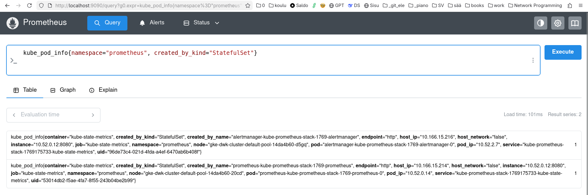

# DevOps with Kubernetes

Tämä on palautusrepo HY:n kurssille.

## Tags

Docker images ([`tomjtoth/devops-with-kubernetes:service-x.y`](https://hub.docker.com/r/tomjtoth/devops-with-kubernetes/tags)) are generated via [GHA](.github/workflows/deploy.yml#L19-L30), tags are parsed from the HEAD commit message ("... `#deploy service:x.y` ...") via regex.

## K3s tweaks

I found the propagation of changes to be imperfect/slow on my setup, hence I decided to recreate the cluster for every single submission via [this script](./k3s.sh).

### Chapter 2

- [1.1](https://github.com/tomjtoth/DevOps-with-Kubernetes/tree/1.1/log_output)
- [1.2](https://github.com/tomjtoth/DevOps-with-Kubernetes/tree/1.2/project)
- [1.3](https://github.com/tomjtoth/DevOps-with-Kubernetes/tree/1.3/log_output)
- [1.4](https://github.com/tomjtoth/DevOps-with-Kubernetes/tree/1.4/todo_app)
- [1.5](https://github.com/tomjtoth/DevOps-with-Kubernetes/tree/1.5/todo_app)
- [1.6](https://github.com/tomjtoth/DevOps-with-Kubernetes/tree/1.6/todo_app)
- [1.7](https://github.com/tomjtoth/DevOps-with-Kubernetes/tree/1.7/log_output)
- [1.8](https://github.com/tomjtoth/DevOps-with-Kubernetes/tree/1.8/todo_app)
- [1.9](https://github.com/tomjtoth/DevOps-with-Kubernetes/tree/1.9/pingpong)
- 1.10
  - [output](https://github.com/tomjtoth/DevOps-with-Kubernetes/tree/1.10/log_output)
  - [server](https://github.com/tomjtoth/DevOps-with-Kubernetes/tree/1.10/log_server)
- [1.11](https://github.com/tomjtoth/DevOps-with-Kubernetes/tree/1.11/log_server)
- [1.12](https://github.com/tomjtoth/DevOps-with-Kubernetes/tree/1.12/todo_app)
- [1.13](https://github.com/tomjtoth/DevOps-with-Kubernetes/tree/1.13/todo_app)

### Chapter 3

- 2.1
  - [pingpong](https://github.com/tomjtoth/DevOps-with-Kubernetes/tree/2.1/pingpong)
  - [log_server](https://github.com/tomjtoth/DevOps-with-Kubernetes/tree/2.1/log_server)
- 2.2
  - [todo-app](https://github.com/tomjtoth/DevOps-with-Kubernetes/tree/2.2/todo_app)
  - [todo-backend](https://github.com/tomjtoth/DevOps-with-Kubernetes/tree/2.2/todo_backend)
- [2.3](https://github.com/tomjtoth/DevOps-with-Kubernetes/tree/2.3/log_output)
- [2.4](https://github.com/tomjtoth/DevOps-with-Kubernetes/tree/2.4/todo_app)
- [2.5](https://github.com/tomjtoth/DevOps-with-Kubernetes/tree/2.5/log_server)
- [2.6](https://github.com/tomjtoth/DevOps-with-Kubernetes/tree/2.6/todo_app)
- [2.7](https://github.com/tomjtoth/DevOps-with-Kubernetes/tree/2.7/pingpong)
- [2.8](https://github.com/tomjtoth/DevOps-with-Kubernetes/tree/2.8/todo_backend)
- [2.9](https://github.com/tomjtoth/DevOps-with-Kubernetes/tree/2.9/todo_reminder)
- [2.10](https://github.com/tomjtoth/DevOps-with-Kubernetes/tree/2.10/todo_backend)

### Chapter 4

- [3.1](https://github.com/tomjtoth/DevOps-with-Kubernetes/tree/3.1/pingpong)
- [3.2](https://github.com/tomjtoth/DevOps-with-Kubernetes/tree/3.2/log_output)
- [3.3](https://github.com/tomjtoth/DevOps-with-Kubernetes/tree/3.3/log_output)
- [3.4](https://github.com/tomjtoth/DevOps-with-Kubernetes/tree/3.4/log_output)
- [3.5](https://github.com/tomjtoth/DevOps-with-Kubernetes/tree/3.5/todo_app)
- 3.6 **SKIPPED**
- 3.7 **SKIPPED**
- 3.8 **SKIPPED**
- [3.9](https://github.com/tomjtoth/DevOps-with-Kubernetes/tree/3.9/todo_app)
- 3.10 **SKIPPED**
- [3.11](https://github.com/tomjtoth/DevOps-with-Kubernetes/tree/3.11/todo_app)
- 3.12 **PENDING**: should be easy, but logs are not visible in the browser

### Chapter 5

- [4.1](https://github.com/tomjtoth/DevOps-with-Kubernetes/tree/4.1/pingpong)
- [4.2](https://github.com/tomjtoth/DevOps-with-Kubernetes/tree/4.2/todo_app)
- [4.3](https://github.com/tomjtoth/DevOps-with-Kubernetes/tree/4.3)
  got 2 results:
  ```sh
  kube_pod_info{namespace="prometheus", created_by_kind="StatefulSet"}
  ```
  
- [4.4](https://github.com/tomjtoth/DevOps-with-Kubernetes/tree/4.4/pingpong)
- [4.5](https://github.com/tomjtoth/DevOps-with-Kubernetes/tree/4.5/pingpong)
  no time for migrations atm, I teardown/re-create my clusters often enough, anyways 🤓
